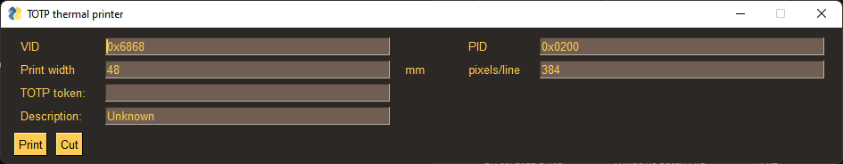
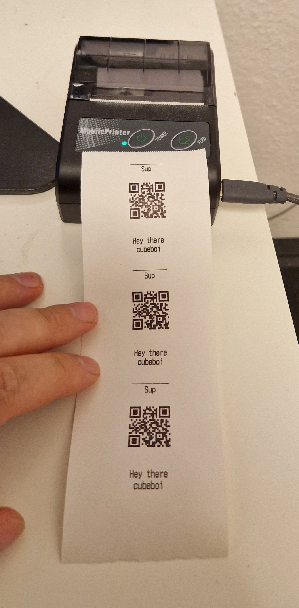

# Thermal TOTP printer

This is a simple python script meant to print your TOTP secret tokens.

This is so you can keep them safe and backed up physically, and is meant to be used in stead of recovery codes.

If you use a password manager as you should, and you have TOTP or recovery codes stored *with* you passwords, it's not 2FA, it's 1.5FA, yes there's still two factors: Knowledge of the master password and possession of the password manager, however as most password managers are accessible via a web-page, that's still only really 1FA.

  



## Install
To install you need conda, and it has to be in your path (i was lazy)

```
conda env create -f environment.yml
```

you may also need to use zadig to set the driver of the printer. I set mine to winusb
I also manually placed libusbs dll in my system32 folder, but later had conda install libusb. Not sure if conda installing it is enough. Ymmw 